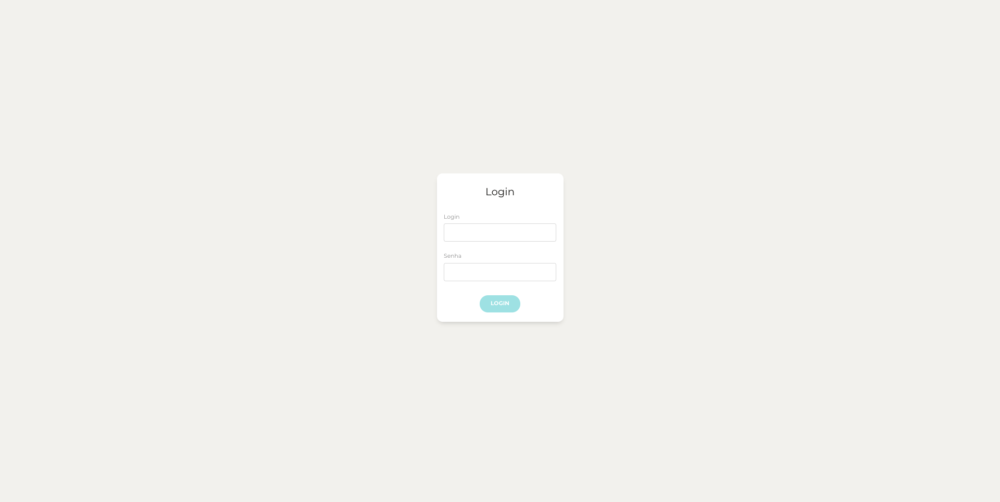
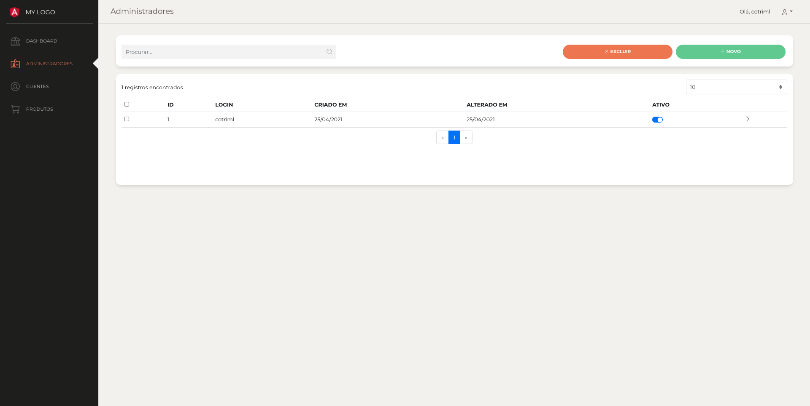
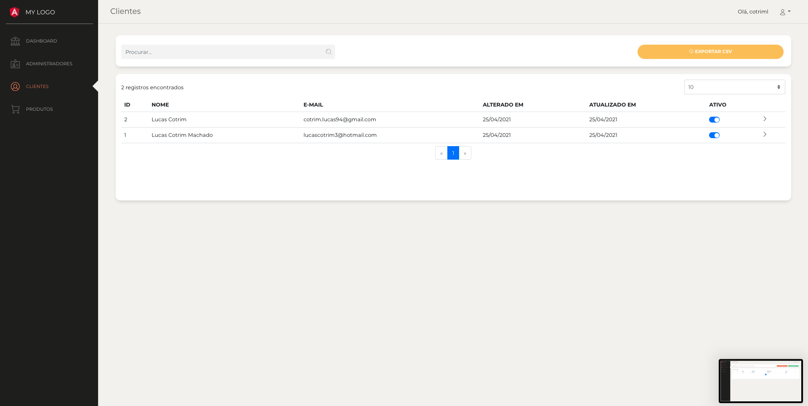
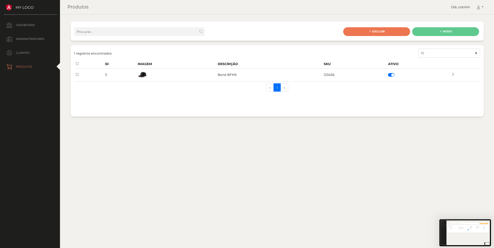
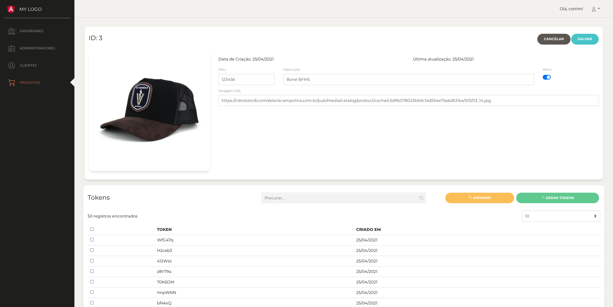
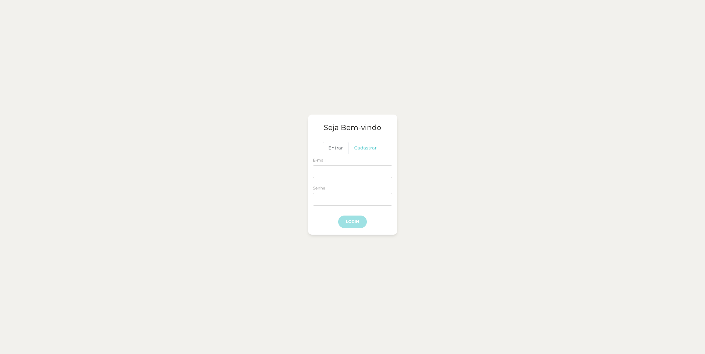
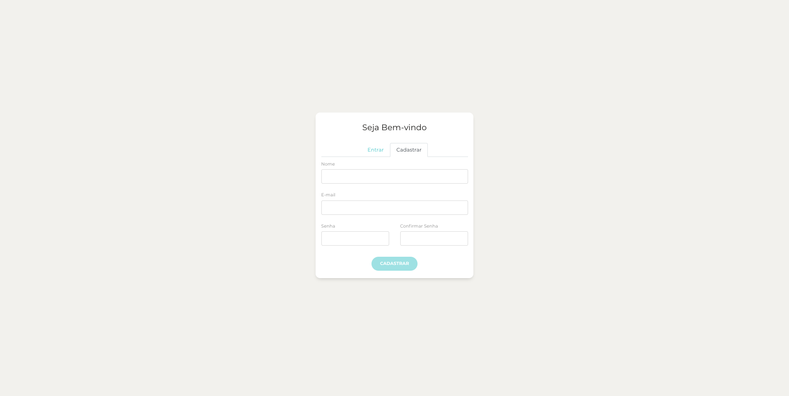
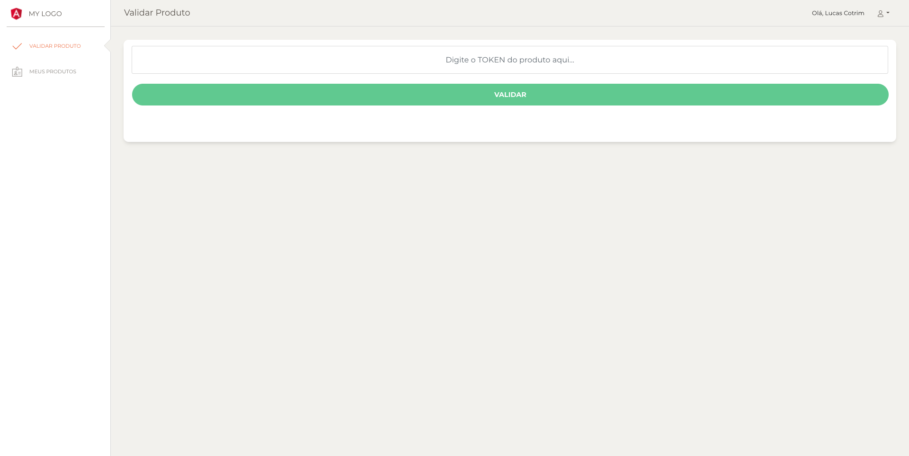
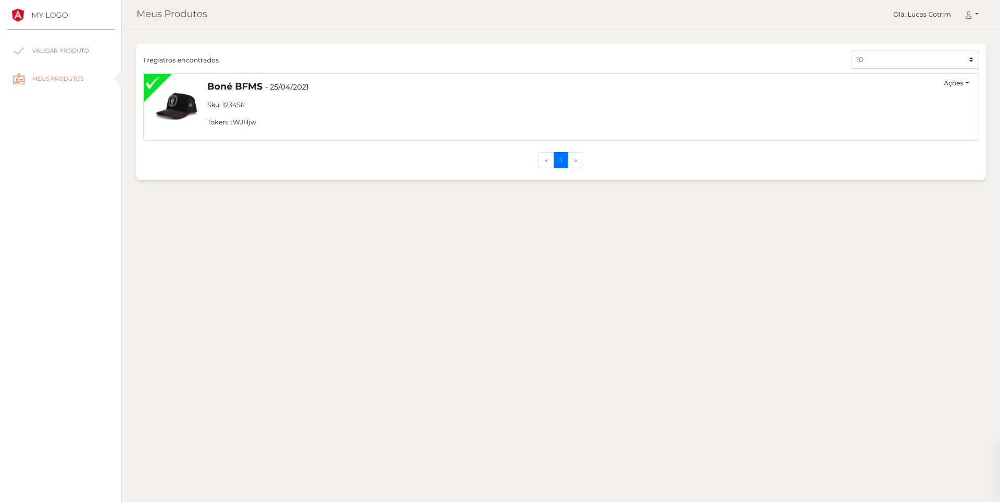

# Validador de Produto Original
 
Esse é um projeto fullstack que teve como principal objetivo o aprendizado. Nele desenvolvi um painel administrativo no qual é utilizado para o gerenciamento de usuários e produtos, um painel para o cliente que serve para autenticação/validação de um produto por meio de um token único e uma API responsável pela comunicação com o banco de dados. 

> ## Casos de uso

* Adm
  * Criar
  * Editar
  * Excluir
  * Listar
  * Logar

* Cliente
  * Criar
  * Editar
  * Excluir
  * Listar
  * Logar
  * Exportar para CSV

* Autorização ou Certificado
  * Criar
  * Excluir
  * Listar

* Produto
  * Criar
  * Editar
  * Excluir
  * Listar

* Token
  * Criar
  * Editar
  * Excluir
  * Listar

> ## Configurando o banco de dados

* Na pasta Backend, configurar o banco de dados no diretório backend > config > database.js

* Criar o banco de dados de acordo com a configuração

* Executar no banco de dados o script SQL do arquivo backend > script-database > script-bd.sql. Este script irá criar todas as tabelas do sistema e incluir um usuário root. 

> login: admin\
> senha: admin

> ## Iniciando o backend (API)

* Ainda na pasta backend, executar o comando abaixo para instalar as dependências do projeto

	`npm install`
    
* Para iniciar a aplicação, execute: 

	`npm start`

> ## Iniciando o frontend

* Na pasta frontend, executar o comando abaixo para instalar as dependências do projeto

	`npm install`
    
* Para iniciar a aplicação, execute: 

	`npm start`

> ## Como esse projeto foi construído

> Backend 
* NodeJs
* Express
* MySQL
* Mocha/Chai
	* Testes de integração
* JWT (jsonwebtoken)

> Frontend
* Angular
	* Layouts 	
	* Components
	* Interceptors
	* Guards 
* ng-boostrap

> ## Telas do projeto

> Painel do Administrador

> Painel do Cliente

